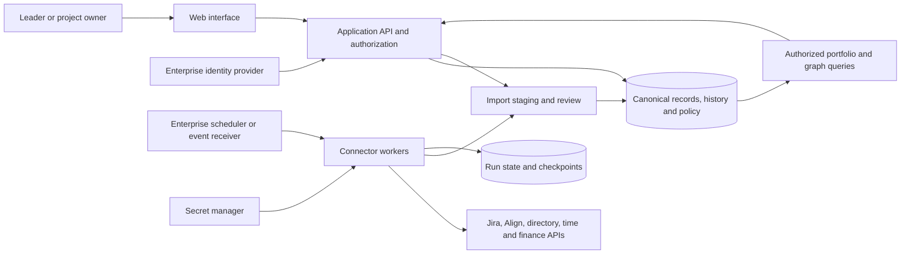

# Enterprise architecture decision

**Status:** recommended target design; the current local implementation is unchanged. Reviewed 12 September 2026 alongside the [product assessment](enterprise-product-assessment.md), [connector contract](enterprise-connectors.md) and [repository audit](enterprise-build-audit.md).

## Decision

Keep **Next.js + SQLite for the local UXD pilot**. Strengthen UXD identities, reviewed ingestion and provenance within that architecture first. Keep the source contracts extensible; cross-domain presets and portfolio-manager use cases are deferred. For a shared enterprise deployment, use an authenticated application/API service with durable storage and a separate ingestion execution boundary. The UI may remain in Next.js or become a statically hosted client that calls the service.

Prefer enterprise-provided identity, secrets, database, monitoring and scheduling services where they meet the requirements. Periscope does not need a new managed-service vendor, dedicated graph database or message broker simply to display a work graph. Add infrastructure in response to concurrency, reliability and organizational requirements.

### Can this be a static site with APIs?

**Yes, as a frontend.** Static hosting can serve the interface, and the browser can request authorized data from enterprise APIs. A backend must still enforce permissions, hold connector credentials, reconcile sources, persist shared edits/history and run reliable synchronization. Those services can be owned by the enterprise rather than bundled with Periscope.

**A static-only demo** can import fictional files into memory and export a result. It cannot by itself provide shared durable state. Browser storage is local to a browser profile and is not an enterprise system of record, audit service or backup strategy.

**The current app cannot become static by changing one setting.** [app/page.tsx](../app/page.tsx) dynamically reads SQLite, and [app/api/plan/route.ts](../app/api/plan/route.ts) supports runtime GET/PUT persistence. Next.js static export emits HTML/CSS/JavaScript at build time; dynamic request handling and server-dependent behavior are unsupported in that output. A future static client must load its workspace through a runtime API, with the current persistence routes moved to a server.[^next]

## Deployment options

| Option | Persistent state | Strengths | Constraints and fit |
| --- | --- | --- | --- |
| Static demo | Memory or local browser storage | Simple distribution of a fictional demonstration | No dependable shared editing, confidential source ingestion or central recovery. Not the enterprise target. |
| Current local Next.js + SQLite | Local SQLite file | One application runtime; no separately installed database server; working pilot | Single-host operations, no application authentication or source synchronization today. Preserve for development and individual evaluation. |
| Next.js service + enterprise database | Approved SQL service | Keeps current UI/server framework together; supports centralized controls and shared state | Requires database adapter/migrations, authentication, authorization and operations work. Recommended first shared deployment if enterprise policy permits Next.js. |
| Static UI + API/backend + database | Approved backend and persistent store | Separates hosting from data access; can fit an established enterprise API platform | Requires client bootstrap/routing changes and a separately deployed API. Same data/security obligations as the preceding option. |
| UI + existing enterprise data/integration services | State lives in existing services | Avoids owning a duplicate datastore if the enterprise services meet the contract | Viable only if those services also support manual records, overrides, history, policy and writes. Delivery APIs alone do not establish those capabilities. |

“No external database installation” accurately describes today's SQLite pilot. “No database dependency” does not: SQLite is a database dependency embedded in Node. A shared product needs persistent storage somewhere; the enterprise can supply it.

SQLite supports many useful application workloads. Its suitability is a concurrency and deployment question, not a blanket prototype/production distinction. It allows one writer at a time; high write concurrency and multiple application servers can favor a client/server database. WAL relies on same-host shared memory and is not a design for sharing a database file across networked application hosts.[^sqlite][^wal] Do not deploy multiple replicas against an arbitrary shared SQLite file or rely on an ephemeral container filesystem for saved work.

A managed relational database is the default recommendation for a multi-instance enterprise service. PostgreSQL is one candidate and supports row-security policies; SQL Server or another approved relational platform may fit enterprise standards better. Row security is a possible enforcement layer, not a substitute for application policy and verified identity.[^postgres] No database migration is included in this assessment.

## Logical design

These are responsibilities, not necessarily separate products or processes. A first deployment can keep the API and ingestion worker in one repository, using SQL job tables and an enterprise scheduler. Long-running synchronization should not depend on a browser tab being open. Durable queues become useful when workload, retries and isolation justify them; a queue is not required for the initial local JSON importer.

### Presentation and API

The UI requests an authorized portfolio scope and receives records, relationships, metric definitions and freshness. Filtering after sending all records to the browser is not authorization. Graph nodes, edges, grid rows, aggregate counts, search and exports must use the same effective policy.

Use a backend-for-frontend where it simplifies SSO and token handling. Store confidential connector credentials server-side. Define session expiry, CSRF protection for cookie-authenticated writes, allowed origins, request limits and export policy. Browser OAuth is possible for some delegated APIs, but is not a substitute for a controlled integration service across internal systems.

Keep the current internal `/api/plan` contract separate from a future public integration API. Whole-plan replacement is useful for the local editor but inefficient and difficult to authorize at enterprise scale. Introduce versioned scoped reads, per-record conditional writes and reviewed bulk ingestion without breaking saved work. A successful HTTP response must identify the committed revision or run; a queued import should return a durable job identifier rather than imply completion.

### Canonical data and relationships

Use typed entities and join tables for portfolios, work items, people, organization units, teams, priorities, allocations and external IDs. Store explicit relationship types such as reports-to, owns, contributes-to, depends-on and advances-objective. Validate allowed endpoints and cycles where the relationship requires a hierarchy.

Separate internal IDs from source instance/entity/record keys. Keep crosswalks and mapping versions; aliases and labels support search but never establish identity. Convert current team/priority labels to stable IDs through a reviewed migration that preserves graph relationships and existing saved records. Make disciplines and work types configurable through a preset instead of renaming hardcoded UXD enums.

Record both **when a fact was valid** and **when Periscope learned it** where historical reconciliation matters. Examples include reporting lines, assignment changes and accounting adjustments. A report must declare whether it uses today's organization or the organization at the time. Reorganizations must not silently rewrite prior accountability or cost attribution.

Financial records require exact amounts/precision, original currency, reporting currency when converted, rate reference, period, source transaction ID, approval state and reversals. Time records require date, unit, person, project and adjustment lineage. A design based only on current project totals cannot support reliable reconciliation or retrospective reporting.

### Ingestion and manual changes

Use one publication path for reviewed JSON, CSV and connector-normalized batches: extract/receive → stage → validate → preview → authorize → commit → audit. Reuse the current combined-import principle that the final people/project relationship set is validated together; extend it with versioning, lineage and scope rather than bypassing review.

Each batch declares schema version, source instance, scope, mode, mapping version and idempotency key. Retain original source timestamps and accepted mappings. Snapshot completeness is essential: a failed page or newly missing permission is not evidence of deletion. Validate the complete declared scope before tombstoning absent records.

Store source values, local fields, overrides and calculations separately. A refresh must not silently erase a manual forecast, and a manual edit must not falsely become a posted finance actual. Provide conflict review, effective-date rules and a visible audit trail. Start with inbound read-only adapters; future writeback requires source-specific concurrency and permission controls.

SQL transactions can atomically publish a local batch and its checkpoint. They cannot make Jira, Align and a finance system mutually transactional. Expose per-source observation dates and a reporting cutoff; avoid claims that a cross-source dashboard is a simultaneous real-time snapshot. Source writes require separate failure/reconciliation handling rather than an implied distributed rollback.

### Security and operations

Before shared use, add authenticated identity, server-side record/field authorization, audit retention, encrypted transport, approved at-rest protection, secret rotation and a restore procedure. Separate organizational hierarchy from project confidentiality. Store source access policy only from trusted adapters or authorized administrators; an uploaded JSON policy label is untrusted input.

Define retention for normalized records, raw imports, rejected records, run logs and audit events independently. Minimize retained source payloads and redact logs. If raw payloads are retained for reconciliation, use access-controlled storage and an explicit deletion policy. Financial and HR-sensitive fields should not be copied into general project logs.

Operational readiness needs a service owner, migration/rollback procedure, backup schedule and demonstrated restore, dependency maintenance, source-health monitoring and incident response. Set recovery objectives, capacity targets and refresh SLAs with the enterprise; no measured production SLA exists today.

## Migration sequence

1. **Preserve the baseline.** Back up saved work, retain CSV behavior, fixtures and graph identity tests. Keep fictional examples session-only.
2. **Strengthen the UXD model locally.** Add stable team/priority IDs, approved UXD discipline/work-type definitions, schema versions and source references through tested SQLite migrations. Defer additional business-domain presets.
3. **Add reviewed JSON.** Implement the formal schema, staging/preview and commit path; verify compatibility, invalid-batch rollback and idempotent replay.
4. **Establish the shared-service boundary.** Choose enterprise identity, policy, storage and deployment. Add authorization before sensitive multi-user use. Migrate database only when the selected deployment requires it.
5. **Connect one source and the approved directory.** Prove mapping, policy propagation, freshness and recovery end to end before adding Align, time and finance adapters.
6. **Choose static hosting if useful.** Move data bootstrap to authorized API calls and deploy the client separately. Test deep links, session renewal, CORS/CSRF, loading/failure states and no embedded confidential data in build output.

Acceptance should demonstrate equivalent portfolio totals and map/grid relationships across the selected deployment, with no saved-data loss, no access leakage and recoverable changes. Do not make static export or a database swap the first milestone; the canonical data and permission contracts provide more durable value.

## Sources

Sources checked 2026-09-12. The installed Next.js guide at `node_modules/next/dist/docs/01-app/02-guides/static-exports.md` was also inspected because repository instructions require version-specific documentation.

[^next]: Next.js, [Static exports](https://nextjs.org/docs/app/guides/static-exports). Supported client-side fetching and limitations of export output.
[^sqlite]: SQLite, [Appropriate uses for SQLite](https://www.sqlite.org/whentouse.html). Deployment and concurrent-write considerations.
[^wal]: SQLite, [Write-Ahead Logging](https://www.sqlite.org/wal.html). Same-host shared-memory requirement and writer behavior.
[^postgres]: PostgreSQL, [Row security policies](https://www.postgresql.org/docs/current/ddl-rowsecurity.html). Optional database enforcement mechanism.
