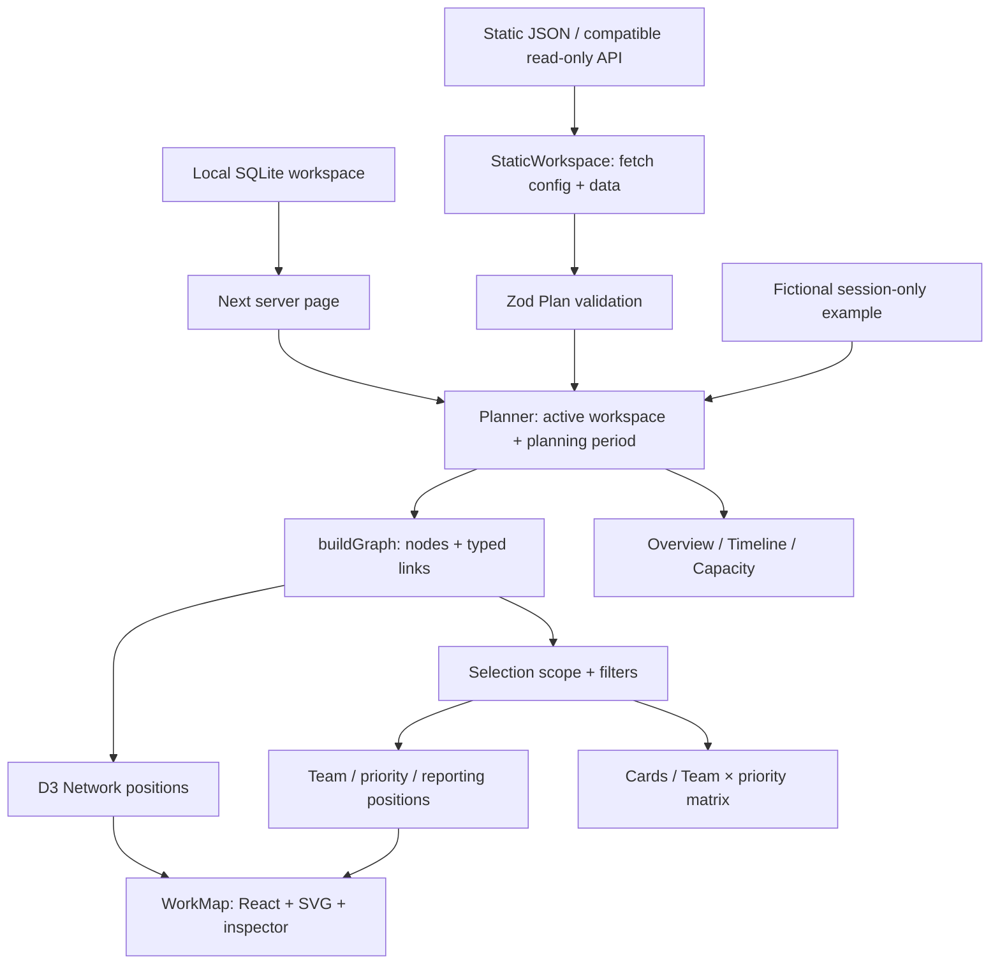

# Periscope technical landscape

Code-based reference, September 21, 2026. Describes the implemented application on codex/organization-explorer, including static JSON deployment. Proposed enterprise integrations are identified separately.

## 1. Architecture at a glance

Periscope turns validated people and project records into an in-memory relationship graph. React renders the graph as SVG. D3 calculates positions for Network; deterministic layout functions arrange reporting, team and priority views.

There is no graph database, vector database, LLM, embedding pipeline, graph query service or automatic relationship inference. SQLite is an optional persistence path for the local editing application; the static viewer does not need it.



The source Plan remains the authority. Graph geometry, camera movement and navigation do not rewrite source records.

## 2. Runtime and build stack

| Layer | Implementation | Responsibility |
| --- | --- | --- |
| Application | Next.js App Router, React, TypeScript | Page shell and interactive views |
| Data contract | Zod schemas | Types, enum validation and relationship integrity |
| Network layout | d3-force | Client-side force simulation |
| Graph display | SVG managed by React | Nodes, links, labels, groups and interaction |
| Group layouts | Pure TypeScript functions | Reproducible positions and ownership/priority grouping |
| Local persistence | Node node:sqlite | Saved workspace, revision-based writes |
| Static deployment | Next static export | HTML, CSS, JS, fonts and JSON served over HTTP |
| Import | CSV parsing and mapping modules | Reviewed local-mode import into the Plan contract |
| Styling | CSS, Fidelity Sans, shared UiIcon SVGs | Consistent typography, controls and responsive layout |

Exact package versions and installation pins are in [package.json](../package.json), [package-lock.json](../package-lock.json) and [.nvmrc](../.nvmrc).

## 3. Canonical data model

[lib/domain.ts](../lib/domain.ts) defines Plan: people, initiatives and revision. “Initiative” is the code name for a project record; it is not a second portfolio hierarchy.

| Record | Relationship-bearing fields |
| --- | --- |
| Person | id, managerId, isLeader, team, title |
| Project | id, leadId, memberIds, priority, dependsOn |
| Project planning/status | start, end, status, delivery, health, importance, effort |

People and project IDs are authoritative. Display names are not join keys. A leader is a person explicitly marked isLeader or referenced as someone else's manager.

Current priority and team identities have an important limitation: priority is a string field, and team is a label on a person. Neither has a separate enterprise organization/taxonomy record. Priority node IDs are derived from the exact priority string. Renaming a priority therefore changes its graph identity. Enterprise priority IDs and organization IDs require an explicit migration.

Validation rejects duplicate record IDs, missing managers, reporting cycles, unknown project owners/contributors, invalid or self dependencies, duplicate contributors/dependencies, invalid dates and unrecognized enum values. It does not currently reject every possible multi-project dependency cycle. The maximum schema array size is 10,000 people and 10,000 projects; this is an input limit, not a demonstrated graph-rendering capacity.

The [fictional JSON fixture](../examples/uxd-demo/workspace.json) is the concrete schema example. [Enterprise data mapping](enterprise-data-mapping.md) documents CSV conventions and future source-authority requirements.

## 4. Building graph identities and edges

[lib/graph-model.ts](../lib/graph-model.ts) creates GraphModel:

```ts
type GraphModel = { nodes: GraphNode[]; links: GraphLink[] };
// node: id, recordId, kind, label, subtitle, attention, top
// link: id, source, target, kind
```

Node IDs use an encoded namespace:
```text
urn:periscope:person:<encoded person ID>
urn:periscope:project:<encoded project ID>
urn:periscope:priority:<encoded priority label>
```

A leader retains a person ID even when rendered with the leader node kind. That prevents identity changes when their leadership classification changes.

| Edge kind | Direction | Source field |
| --- | --- | --- |
| reports | Report → manager | Person.managerId |
| owns | Person → project | Project.leadId |
| contributes | Person → project | Project.memberIds |
| supports | Project → priority | Project.priority |
| depends | Project → prerequisite project | Project.dependsOn |

Example: Nina reports to Maya; Maya owns Account opening redesign; that project supports Client onboarding and depends on Accessible component library. Each connection comes from a recorded field.

The builder:
1. Includes projects overlapping the selected period, using inclusive start/end comparison.
2. Includes all people and priorities represented by those projects.
3. Adds links only when both endpoints exist in that graph.
4. Deduplicates links by kind/source/target.
5. Suppresses a redundant contributor edge when that person already owns the project.

A dependency outside the displayed period may therefore be absent from the graph, although the full Plan still contains it. The Timeline can show such recorded dependencies in details.

Graph edges carry direction even though some interactions traverse them both ways. Selection neighborhood highlighting follows either endpoint; the inspector uses direction-specific labels such as Reports to versus Direct report.

## 5. Scope, filters and navigation

[lib/graph-scope.ts](../lib/graph-scope.ts) keeps selection semantics separate from layout:

- Person/leader selection includes the full reporting subtree and projects owned by or involving members of that subtree. Related contributors and priorities provide context; they are not implied direct reports.
- Project selection includes its recorded incoming and outgoing dependency neighbors, plus owners, contributors and priorities. This is immediate dependency context, not an unlimited dependency traversal.
- Priority selection includes projects supporting that priority.
- Reporting mode follows descendants through reporting edges only.

Top priorities and Needs attention select matching projects and include relevant people, priorities and management chains. Node-kind toggles remove hidden types and their incident links.

Search has different presentation semantics: the map highlights matching nodes and provides search results; Grid filters matching cards, and the matrix counts the resulting project set. It is not a query engine over arbitrary graph paths.

[lib/graph-navigation.ts](../lib/graph-navigation.ts) manages a stable-ID visit trail. Back retraces selection history; it is not a fabricated organization breadcrumb. Reset view clears selection and filters. Selecting a group header changes the camera rather than the data scope. Fit resets that camera. A separate “Back to teams” camera-return control is documented as a recommendation, not implemented.

Layout selection and Map/Grid share the current scope. The map stays mounted when other major views open, supporting return to context. State is session-local, not durable across reloads. Static Refresh data deliberately reloads the validated snapshot and resets transient navigation.

## 6. Layouts: one graph, different positions

| View | Module | Rule |
| --- | --- | --- |
| Network | [graph-layout.ts](../lib/graph-layout.ts) | Force-directed relationship layout |
| Reporting lines | [reporting-layout.ts](../lib/reporting-layout.ts) | Managers above reports; deterministic forest layout |
| By team | [team-layout.ts](../lib/team-layout.ts) | Accountable-owner reporting group; each visible node once |
| By priority | [priority-layout.ts](../lib/priority-layout.ts) | Explicit priority membership; each visible node once |
| Width adaptation | [group-layout.ts](../lib/group-layout.ts) | Stretch horizontal geometry to fill available desktop width |

Network sorts IDs, seeds initial positions, then runs 220 stopped-simulation ticks with link, charge, collision and centering forces. It works on copies because D3 mutates particles and link endpoints. Positions are rounded to reduce insignificant rendering differences. Node radius combines type and connection count; it does not represent budget or allocated FTE.

Network positions are derived from the period graph, then the visible scope is rendered. This helps retain spatial context when filters change. Grouped layouts are rebuilt from the visible graph using the full Plan for ownership lookup.

By team resolves the highest leader below the reporting root through manager IDs. The reporting root gets its own first cell. Projects appear once under their accountable owner's group; shared contributors do not duplicate projects. Invalid/unassigned ownership is explicit. People and projects occupy separate bands. Shared priorities span the bottom row.

By priority places projects under their supports relationship. Missing/ambiguous membership goes into Unaligned work. People occupy a separate full-width bottom group rather than being duplicated across priorities. Hidden priority nodes do not incorrectly make a project unaligned.

Grouped links crossing panel boundaries are shown when an endpoint is selected or hovered. Within-group links remain visible. Labels and nodes remain rendered at overview zoom. Desktop layouts use three columns; narrow screens stack panels. Group positions are not directly draggable; Network supports temporary node dragging.

## 7. Rendering and interaction

[app/work-map.tsx](../app/work-map.tsx) owns orchestration and interaction state. [app/work-map.css](../app/work-map.css) owns responsive presentation.

- SVG groups apply translate/scale using a camera {x, y, k}.
- React renders group panels, edges and nodes from positioned data.
- Pointer handling implements pan, node selection and Network dragging.
- Wheel and controls change zoom; keyboard navigation is available when the graph has focus.
- SVG nodes expose button roles, labels and keyboard actions.
- The inspector resolves records by ID and displays actual relationship labels.
- Browse list provides a text-based selection panel; Grid provides a comparison alternative.
- No WebGL renderer or graph library service is involved.

Large datasets require profiling. Network simulation currently runs synchronously in the browser; the SVG has one or more elements per node/link. Workers, progressive loading, aggregation and virtualization are future scaling options, not current guarantees.

## 8. Adjacent views and calculation boundaries

| Feature | Files | Meaning |
| --- | --- | --- |
| Card grid | [work-grid.tsx](../app/work-grid.tsx), [graph-grid.ts](../lib/graph-grid.ts) | Same scoped graph as readable cards |
| Team × priority | [priority-matrix.ts](../lib/priority-matrix.ts) | Counts visible projects by accountable group and exact priority |
| Leadership brief | [leadership-brief.ts](../lib/leadership-brief.ts) | Recorded decisions/risks and selected-period due dates |
| Timeline | [project-timeline.tsx](../app/project-timeline.tsx), [timeline.ts](../lib/timeline.ts) | Source dates clipped to period, recorded dependencies on selection |
| Capacity | [capacity.ts](../lib/capacity.ts), [allocate.ts](../lib/allocate.ts) | Discipline-level FTE forecasting from planned effort |

Project membership and matrix counts are not individual allocations. Current snapshots cannot establish “what changed since last week” without historical records. Health, delivery and commitment are distinct fields.

## 9. Two data-loading and deployment paths

### Static, read-only sharing

```text
data/config.json → configured JSON URL → Plan validation → Planner(readOnly)
```

[StaticWorkspace](../app/static-workspace.tsx) loads configuration and data in the browser, resolves dataUrl relative to the configuration URL, and validates the Plan via [static-source.ts](../lib/static-source.ts). Failed fetches/validation show an explicit error and Retry; no fictional fallback is substituted.

[build-static.mjs](../scripts/build-static.mjs) stages source in .static-build, replaces the server page with StaticWorkspace, excludes app/api and lib/db.ts, and runs a static export. Output is static-site. It does not alter the local .next build or saved database. [preview-static.mjs](../scripts/preview-static.mjs) is a simple optional local file server.

Static mode removes mutation entry points, guards saves and ships no write endpoints. This is not an authentication system: approved hosting/API access controls must protect enterprise records. Refresh reloads the snapshot; it is not automatic source synchronization.

### Local editing workspace

[app/page.tsx](../app/page.tsx) reads [lib/db.ts](../lib/db.ts) and supplies Planner with an initial workspace. SQLite stores people, projects and revision metadata. Local edits use PUT /api/plan, schema validation and revision checks; the route also checks origin and request size. This local mode has no enterprise authentication.

Fictional example edits remain in browser session state rather than the saved workspace. Static mode uses its supplied snapshot directly and does not expose the local/example toggle.

See [static deployment](static-deployment.md) and [installation](installation.md) for exact commands and operational limits.

## 10. JSON-LD and exports

[workGraph(plan)](../lib/work-graph.ts) serializes records as JSON-LD with schema.org Person/Project types and Periscope vocabulary terms for relationships and planning fields.

This export and the visual graph share identity conventions, but are different representations:
- GraphModel contains explicit rendering nodes/edges for a period.
- JSON-LD represents the full supplied Plan.
- The map export currently calls workGraph(plan), so it exports the loaded workspace, not only the visible selection or period.
- Local GET /api/graph exports the persisted SQLite workspace. It is absent from the static deployment.

JSON-LD export does not imply a triple store, RDF reasoning or a SPARQL endpoint.

## 11. Enterprise extension path

The intended boundary is:

```text
Enterprise source platforms
  → approved authenticated gateway / normalization process
  → validated canonical JSON
  → read-only Periscope
```

A compatible API can replace the JSON URL. Raw Jira, directory or time-tracking responses cannot simply be substituted: IDs, status labels, field authority and relationships need agreed mappings.

Before broader enterprise/BU navigation, add explicit organization and parent-organization records and durable priority IDs. Before “Open in source,” map trusted source record URLs. Before change history or freshness assurances, add source timestamps and snapshot/event history.

Secrets, source edit permissions and enterprise authorization belong outside the static bundle. Browser access is limited to the records the host/gateway permits. The graph must not invent reporting or project relationships from names.

## 12. Verification and maintenance map

- Domain/import integrity: domain/import tests plus static-source.test.ts.
- Graph edges, scope and navigation: graph-map, graph-scope, graph-navigation tests.
- Layout identity, bounds and grouping: team-layout, priority-layout, reporting-layout, group-layout tests.
- Matrix/date/brief behavior: priority-matrix, timeline, leadership-brief tests.
- Browser checks: selection → scope → layout/Grid → inspector; Back/Reset; mobile; fullscreen; read-only restrictions.
- Deployment checks: normal production build, static export, subpath export, source failures/recovery, no static write API.

At this documentation pass, the latest completed validation recorded 89 tests passing and successful normal/static/subpath builds. This is historical verification, not a fresh test run for this documentation-only change.

Useful commands:
```sh
npm test
npm run typecheck
npm run build
npm run build:static
npm run preview:static
```

When changing the data model, update validation, import mappings, fixture data, graph construction and tests together. When changing a layout, preserve node IDs/counts and scope; positions should never alter relationship meaning.
